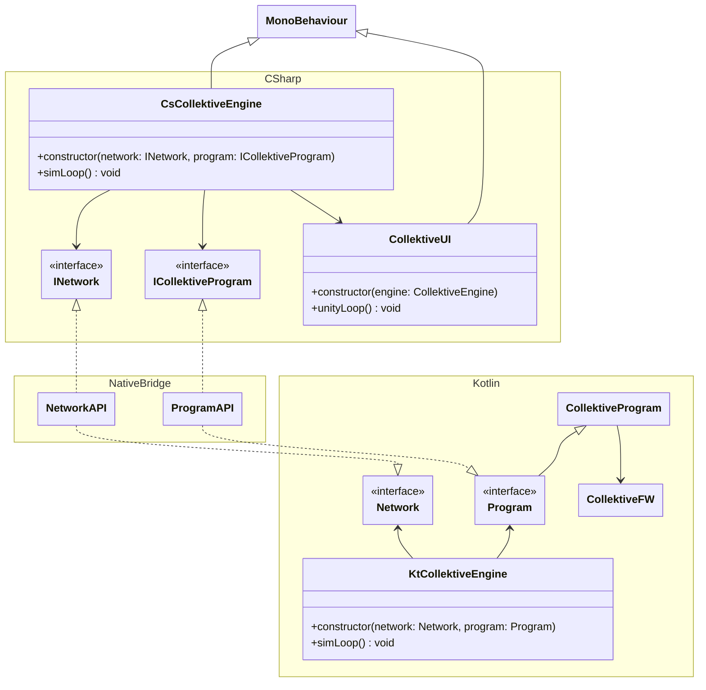

# Collektive Infos

This files contains everything I've learned (not trivial, at least for me) during my exploration of Collektive and aggregate computing in general.

## ID generic type

Collektive uses a generic type in almost any of its API that is called `ID`. This should represent the fact that the client could define what an ID is but most of the times it's just ok to use Int.

However this could be a good point in which to use complex data structures in order to inject complex behaviour in each node of the aggregate. This though should be more related to the concept of **node** more than **ID** but I didn't find a better way.

### Collketive class

Collektive provides an implementation for the representation of a node that is the `Collektive` class. Nothing special about that besides the fact that it exists.

## Branching logic in aggregate computing and the when scenario

```kotlin
fun Aggregate<Int>.hopCountGradientNotWorking(source: Boolean): Int =
    share(Int.Companion.MAX_VALUE) { field ->
        when {
            source -> 0
            else -> {
                val bestNeighbor = field.neighbors.values.min()
                val result = if (bestNeighbor == Int.MAX_VALUE) {
                    Int.MAX_VALUE
                } else {
                    bestNeighbor + 1
                }
                result
            }
        }
    }

fun Aggregate<Int>.hopCountGradientWorking(source: Boolean): Int =
    share(Int.Companion.MAX_VALUE) { field ->
        val bestNeighbor = field.neighbors.values.min()
        val result = if (bestNeighbor == Int.MAX_VALUE) {
            Int.MAX_VALUE
        } else {
            bestNeighbor + 1
        }
        when {
            source -> 0
            else -> result
        }
    }
```

The previous functions reflect the concept of branching in aggregate computing. The branching splits the overall network into 2 different, *separated* clusters. They don't talk to each other since they took different paths (in the when statement).

## Tooling

Useful gradle bare bones to startup new projects.

For multiplatform libs:

```kotlin
plugins {
    kotlin("multiplatform") version "<version>"
    id("it.unibo.collektive.collektive-plugin") version "<version>"
}

repositories {
    mavenCentral()
}

kotlin {
    linuxX64("native") {
        binaries {
            sharedLib {
                baseName = "<lib-name>"
            }
        }
    }

    sourceSets {
        val commonMain by getting {
            dependencies {
                implementation("it.unibo.collektive:collektive-dsl:<version>")
                implementation("it.unibo.collektive:collektive-stdlib:<version>")
            }
        }
        val nativeMain by getting
    }
}
```

and structure the project as follows:

```bash
lib/
└── src/
    ├── commonMain/
    │   └── kotlin/
    │       └── <files-and-dirs>
    ├── commonTest/
    │   └── kotlin/
    │      └── <test-files-and-dirs>
    ├── nativeMain/
    │   └── kotlin/
    │      └── NativeExports.kt
    └── nativeTest/
        └── kotlin/
           └── NativeTest.kt
```

Useful csharp bare bones to startup new projects:

### build-kotlib.sh

```bash
#!/bin/bash

bash -lc 'cd ../<kt-lib-proj> && ./gradlew build'
```

### csproj

```xml
<Project Sdk="Microsoft.NET.Sdk">

  <PropertyGroup>
    <OutputType>Exe</OutputType>
    <TargetFramework>net9.0</TargetFramework>
    <ImplicitUsings>enable</ImplicitUsings>
    <Nullable>enable</Nullable>
  </PropertyGroup>

  <Target Name="BuildKotlinLib" BeforeTargets="Build">
    <Exec Command="./build-kotlib.sh" />
  </Target>

  <ItemGroup>
    <Content Include="..\kt-lib-proj\lib\build\bin\kt-lib-name\releaseShared\kt-lib-name.so">
      <Link>kt-lib-name.so</Link>
      <CopyToOutputDirectory>PreserveNewest</CopyToOutputDirectory>
    </Content>
  </ItemGroup>
</Project>
```

## Questions

- How should I model the information coming from unity through collektive? Can I use the ID generic type or is it better to stick to what alchemist do?
- What kind of APIs should my project expose?
  1. a file in which implement a function of type `fun Aggregate<ID>.myFunction(???): ???` in kotlin
  2. a C# framework that exposes some sort of APIs to interact with the underlying written function (1.) and the Collektive ecosystem
  3. a Unity asset/Unity exe that takes as input a simulation configuration (e.g. a yaml) and runs the simulation (exploiting the 2.)

Considerations about the API:

- The final user should write only code for 1 and 3 (note that 3 actually requires some sort of configuration file, not specifically code)
- the second point will actually be the wrapper around collektive, implementing:
  - a collektive engine in kotlin that takes as input the network configuration and the collektive program and expose apis to run the simulation (without ui)
  - 2 layers for native, 1 in kotlin (mapping collektive engine) and 1 in C# mapping back the kotlin native layer
  - a collektive engine in C# that taskes the same stuff as input (as for collektive engine in kotlin) but it just passes them through the native layer

I guess the third point should be a unity asset since the 1 must be compiled along with C# framework (2.)

- Is there a way to pass to a compiled code a source code and let it compile and inject inside the already compiled code?

## Architecture sketch


